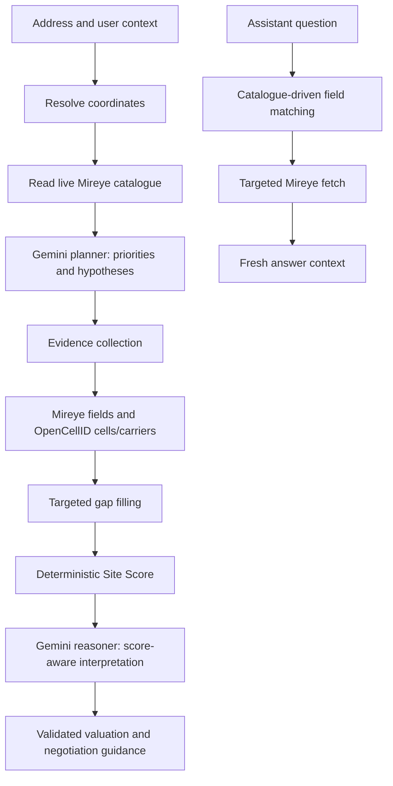

# SignalRent

Cell tower lease valuation. One address, 60 federal data points, a data-backed estimate and a read on your negotiating leverage.

## What is SignalRent?

SignalRent tells US property owners what their cell tower lease is actually worth. Enter an address, get a data-backed valuation estimate tied to federal tower siting data, benchmark market ranges, and plain-English negotiating guidance.

**The free valuation includes:**
- Site Score (0–100) with dimension breakdown
- Market benchmark range (monthly and annual)
- Negotiating position analysis
- Optional rate comparison and buyout analysis

## Architecture: deterministic score, agentic evidence and reasoning

SignalRent is a hybrid system. The numeric Site Score remains deterministic and locked: the same Mireye fields, OpenCellID carrier inputs, weights, and scoring rules produce the same score. Gemini does not rewrite those score numbers.

Gemini operates around that stable scoring core. It reads the live Mireye catalogue, selects priorities, creates site-specific hypotheses, interprets the completed score and evidence registry, derives the market benchmark, and writes negotiation guidance. It may adjust the explanation, benchmark range, leverage summary, and data-gap assumptions, but the locked score remains the source of truth for the score itself.



### Initial valuation flow

1. The planner loads the live Mireye field catalogue and asks Gemini for site-specific priorities and hypotheses.
2. All fields required by the deterministic scorer and benchmark logic are preserved, while planner-selected fields and critical competition/subscriber fields are included.
3. Mireye evidence and OpenCellID data are collected. OpenCellID contributes nearby cells and carrier presence for tower-capacity interpretation.
4. The assessor identifies high-impact gaps and can issue targeted `mireye_ask` follow-ups.
5. The deterministic scorer computes the locked score using fixed weights: Coverage Necessity 40%, Subscriber Value 35%, Construction Cost 25%.
6. The reasoner receives the locked score, raw fields, evidence registry, OpenCellID data, hypotheses, and gap-fill results before producing the benchmark and landlord-facing interpretation.

### Conversational follow-ups

The assistant does not treat the initial valuation as the complete knowledge base. For a question such as “Is temperature a factor?”, it uses the live catalogue to identify relevant fields, fetches only missing fields from Mireye, and answers using that fresh evidence. This supports new Mireye fields and future data providers without requiring a hard-coded question-to-field map.

The same boundary applies to scoring: deterministic numeric outputs are reproducible; agentic interpretation is evidence-driven and extensible. New fields can inform hypotheses, benchmark explanations, data-gap assumptions, and assistant answers without silently changing the score formula.

## Environment Setup

### Required: Mireye API Key & Mapbox Token

1. **Mireye API key**: Sign up at [mireye.com](https://mireye.com), get key from project settings
2. **Mapbox token**: Get a public token from [mapbox.com](https://mapbox.com)
3. Set both in Vercel: Project Settings → Environment Variables:
   - `MIREYE_API_TOKEN` (server-side only; bearer token used by the Mireye MCP/API integration)
   - `NEXT_PUBLIC_MAPBOX_TOKEN` (public, used in browser)

### Local Development

```bash
# Clone the repo
git clone https://github.com/YOURNAME/signalrent.git
cd signalrent

# Install dependencies
npm install

# Set environment variables
cp .env.example .env.local
# Edit .env.local and add:
#   MIREYE_API_KEY=your_mireye_key
#   NEXT_PUBLIC_MAPBOX_TOKEN=your_mapbox_token

# Run dev server
npm run dev
```

Open [http://localhost:3000](http://localhost:3000) in your browser.

## Data Sources

Benchmark ranges are calibrated to published industry data (Steel in the Air, Vertical Consultants, Tower Genius) and documented negotiated outcomes. Site valuations are derived from:

- **FCC Antenna Structure Registry** — tower locations and attributes
- **USDA SSURGO** — soil and bedrock depth
- **FEMA National Flood Hazard Layer** — floodplain exposure
- **USFWS National Wetlands Inventory** — wetland status
- **US Census** — housing density and population
- **NOAA & USGS** — seismic and lightning risk

Not a substitute for professional appraisal.

## Scripts

```bash
npm run dev        # Start development server
npm run build      # Build for production
npm start          # Start production server
npm run lint       # Run ESLint
npm test           # Run Jest tests
npm run test:watch # Watch mode for tests
```

## Technology

- **Next.js 16** — App Router, TypeScript
- **Tailwind CSS** — Utility-first styling
- **Zod** — Runtime validation
- **Jest** — Unit tests

## License

See LICENSE file.

---

Built on Mireye.
